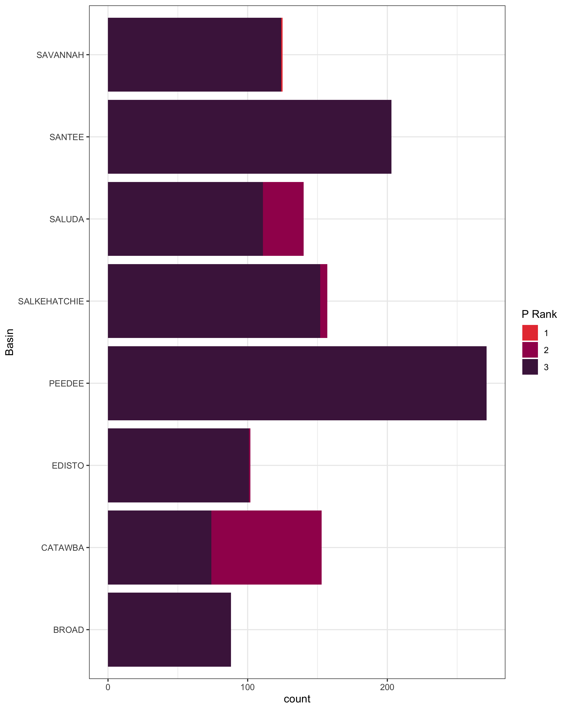
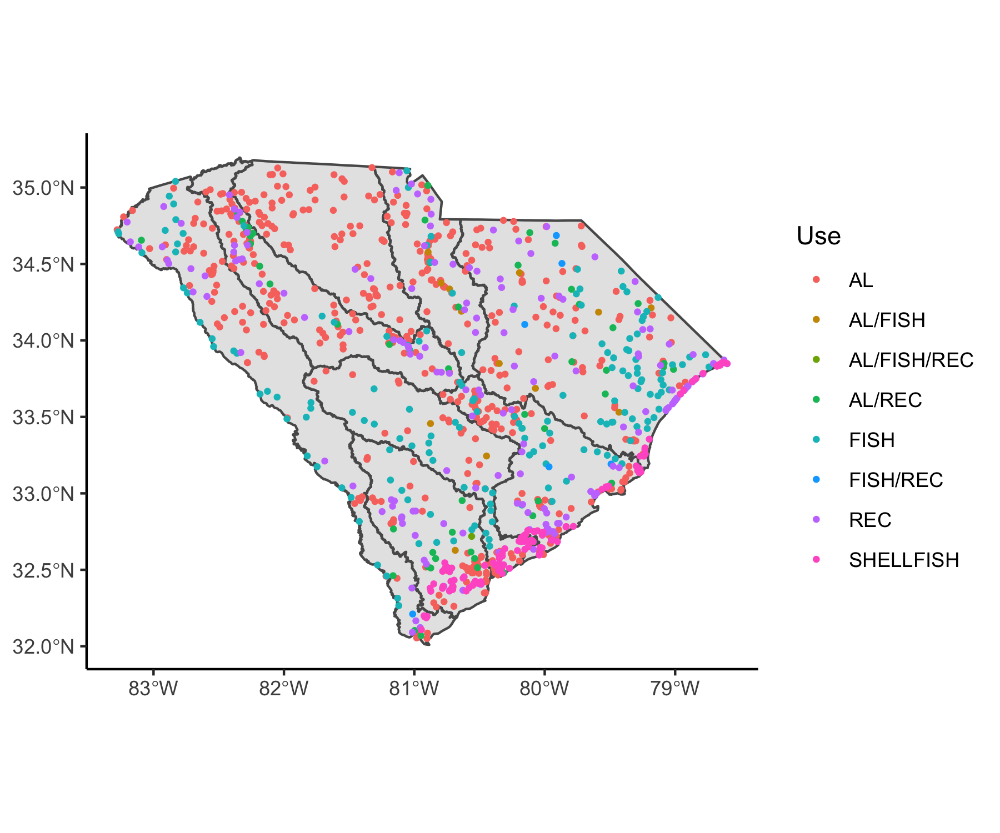
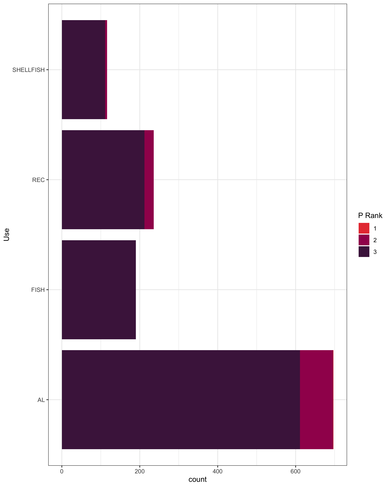
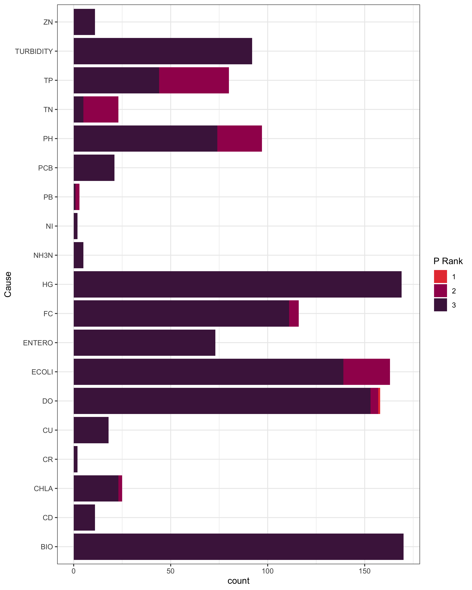
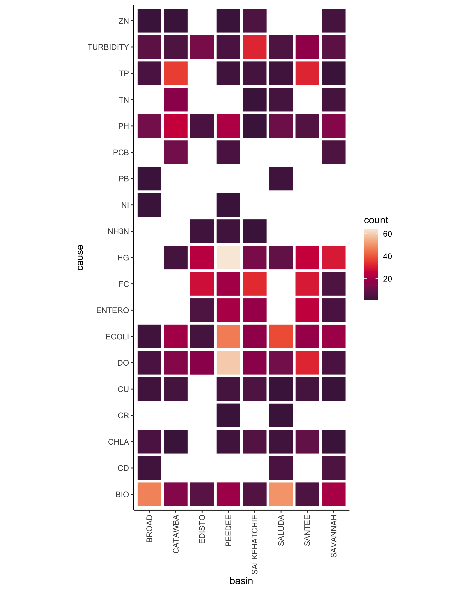
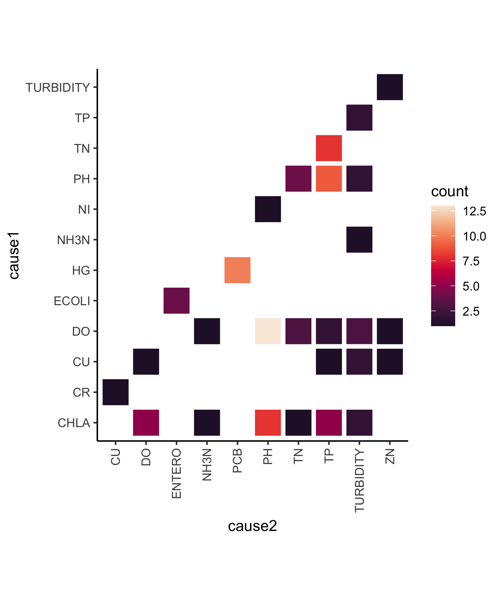
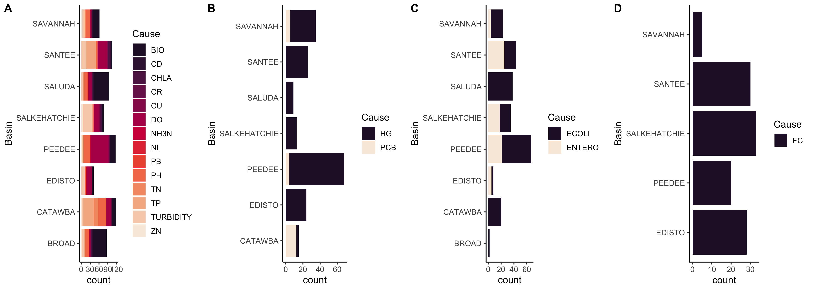

Intro:
The 303d list identifies impaired water bodies within each state, listing uses of the water body and causes of impairment. The goal of our project was to understand the relationship between priority ranking and impairment with respect to basin, use, and cause. We created bar plots and heat maps to compare the impaired water bodies and their priority rankings in the categories previously mentioned. We investigated and visualized the causes of impairment, to better understand impairment in relation to basin and use. 

We hypothesized that basins with an increased number of impaired waters due to a multitude of causes would rank higher in priority. To test this hypothesis, we looked for relationships between priority ranking with respect to utilizing data from the 2018 303d list to disseminate trends. 


#### Priority ranks

The priority ranks are defined as:


1 = __Current Priorities__ are those site/pollutant combinations being addressed by TMDL or
alternative restoration plans being developed during the 2016-2018 time-frame.


2 = __Near Term Priorities__ are those site/pollutant combinations being addressed by TMDL or alternative restoration plans being developed during the 2019-2022 time-frame.


3 = __Long Term Priorities__ are those site/pollutant combinations being addressed by TMDL or
alternative restoration plans being developed after 2022.

## Basin and priority rank:

{width=70%}

_Figure 1. Uses of all sites assessed for 2018 303d list in each basin in South Carolina._  
From the above figure, we see that the number of priority rankings ranges from approximately 80 in the Broad basin to about 280 for the Pee Dee. We also observed that the Catawba has a larger number of higher ranked waters than any other basin. Finally, we observed that most of the water bodies within each basin have been listed as priority 3.  Our next steps were to examine how much of each basin hosts impaired water bodies and to look at uses and causes of impairment. 

```{r, echo=FALSE}
BROAD_IMPAIRED=(79/(79+117))*100
CATAWBA_IMPAIRED=(104/(32+104))*100
EDISTO_IMPAIRED=(95/(95+95))*100
PEEDEE_IMPAIRED=(229/(229+170))*100
SALKEHATCHIE_IMPAIRED=(128/(128+171))*100
SALUDA_IMPAIRED=(121/(121+76))*100
SANTEE_IMPAIRED=(171/(171+260))*100
SAVANNAH_IMPAIRED=(113/(113+177))*100

basin_percent_imp<- rbind(BROAD_IMPAIRED, CATAWBA_IMPAIRED, EDISTO_IMPAIRED, PEEDEE_IMPAIRED, SALKEHATCHIE_IMPAIRED,SALUDA_IMPAIRED,SAVANNAH_IMPAIRED)
  
basin_percent_imp <- as.data.frame.matrix(basin_percent_imp)

basin_percent_imp$V1 <- round(basin_percent_imp$V1, 0)

names(basin_percent_imp) <- "percent"

basin_percent_imp

```

From the above table, we see that the percent impairment for South Carolina basins ranges from 39% to 76%. The Catawba has the largest percent of impaired water bodies which corresponds with this basin also having the highest number of priority 2 rankings. Based on the large number of basins with priority rankings of 3, we decided to run a t-test using a 95% confidence interval to determine if the percent impairment of each basin is significant, and indeed they were (p = 5e-05). Seeing that priority rankings do not completely reflect percent impairment for each basin, our next step was to examine the relationship between priority rank and use.

```{r}
t.test(basin_percent_imp)

```


#### Use and priority rank
 
{width=60%}

_Figure 2. Uses of all sites assessed for 2018 303d list. The basin regions are outlined in dark grey._

`USE` can either be `SHELLFISH`, referring to shellfish consumption; `REC`, referring to recreational use such as swimming; `FISH`, referring to fish consumption; or `AL`, referring to aquatic life.


{width=50%}
 
 _Figure 3. Bar plot depicting the uses of impaired water bodies filled in by priority rank_

Aquatic life contains the only impairment listed as a priority ranking of 1, meaning the only impaired water body being actively addressed is classified as AL. Fish is the only use that does not contain a priority ranking other than 3. Recreational and shellfish include 2 and 3 rankings. A priority rank of 3 being the majority of rankings across all uses. 

Although aquatic life is the majority use (n=590), we were surprised to find that it is the only use that had was being addressed or had a developing plan for addressing pollutants because we assumed water bodies being used for shellfish, fish, and recreation pose a larger threat to human health.  

#### Cause and priority rank 


{width=45%} {width=45%}


_Figure 4. (left) Bar plot depicting the various causes, filled by priority rank._  
  Most impaired bodies, regardless of their associated cause, exhibit a priority ranking of 3. Some impaired bodies (20-40) exhibit priority ranking 2, namely those with E.Coli, dissolved oxygen, pH, total nitrogen, and fecal coliform as causes. Impaired basins with total phosphorous listed as a cause have the highest count of priority ranking 2 when compared to other causes. 
  
  The ratio of priority rank for each cause could indicate that the causes with near term priority (priority rank 2), solutions already exist for TMDL to apply or are possible to develop plans for restoration (i.e., total nitrogen (TN) and lead (PB) have a majority of near term priority rankings).   

_Figure 5. (right) Heat map of the various pairs between causes and basins of impaired water bodies._
  
  This heat map highlights the variation of frequency by cause between each basin. The Peedee basin has over 60 impaired bodies associated with mercury (HG), as well as 50-60 bodies associated with dissolved oxygen (DO). Both the Broad and Saluda basins have high counts of impaired bodies associated with biological causes (BIO). The most prevalent causes -  biological (BIO), mercury (HG), dissolved oxygen (DO), and *Escherichia coli* (ECOLI) - vary in frequency among the basins. Management plans by use and basin may be an efficient mode of planning. 


{width=70%}
_Figure 6. Heat map of the number of water bodies with 2 causes or more attributed to their impairment._

Common pairings of causes include dissolved oxygen (DO) & hydrogen ion concentration (PH), mercury (HG) & polychlorinated biphenyls (PCB), total phosphorus (TP) & total nitrogen (TN), and chlorophyll-a (CHLA) & hydrogen ion concentration (PH). Biological as a cause is missing from this heat map, and it is not listed on the causes in the explanation of the data.


### Causes and use 



_Figure 7. Bar plots depicting various causes associated with each basin. (A) Impaired water bodies listed as "Aquatic Life" under usage. (B) Water bodies listed as "Fish" under usage. (C) Water bodies listed as "Recreational" under usage. (D) Water bodies listed as "Shellfish" under usage._

  Water bodies used for aquatic life (Figure 7A.) display the most variety of causes associated with the different basins. The other three usages, however, have only one or two different causes associated with each basin. Interestingly, every single impaired water body that falls under the "Shellfish" category (Figure 7D.) is associated with fecal coliform bacteria. Fecal coliform bacteria, however, is never listed as a cause for the other usages. 


#### Conclusion:

Our visualizations depict the general trends of priority rankings among basins, use, and cause, and the cause and impairment by use. We found that Catawba has the most near term priority rankings, as well as the highest percent of impaired of total water bodies. By use, aquatic life had the most impairments, and was the only use category to have an actively managed water body. Certain causes have higher ratios of near term priority rankings (rank 2) indicating a higher importance over causes have only long term priority ranks (rank 3). Figure 7 breaks down the different causes by use that classify a water body for impairment. Aquatic life water bodies in 2018 were impaired due to 14 causes with the most vague cause being BIO (i.e, biological). Mercury (Hg) and polychlorinated biphenyls (PCB) are the causes of impairment in water bodies used for fish consumption. For recreational use, water body impairment is classified _Enterococci_ (ENTERO) or _Escherichia coli_ (ECOLI). Both are indicators of fecal matter in the water, according to wikipedia measures of _Enterococci_ is used at salt water beaches and _Escherichia coli_ at fresh water beaches. Another measure of fecal matter in water is FC, which is fecal coliform bacteria, and is used to classify impairment of water bodies used for shell fish consumption. The Peedee basin has the most impairments due to mercury and recreational impairments due to fecal matter. Future directions of this work could incorporate measurements by cause to classify water bodies that have the most fecal matter in them, across the 3 different measures. 


